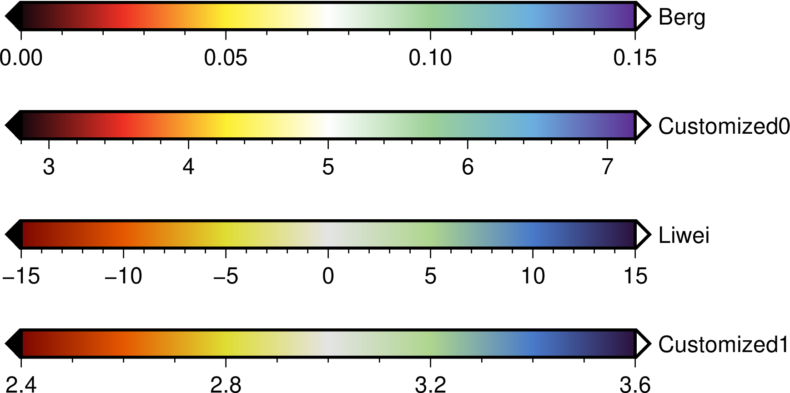

# README

```
.
├── plot.sh  # 绘制示例CPT文件
├── makecpt.py  # 给定[vmin, vmax]和模板文件，生成自定义CPT文件的Python脚本              
├── template                  
│   ├── Berg.dat  # 提取的Berg et al,2021绘制速度剖面所用的颜色参考文件
│   └── Liwei.dat # 同上, 参考了Liwei et al., 2021, GRL
├── cpt                    
│   ├── depth.cpt  # 存放cpt文件
├── fig  # 用于存放生成的图片文件  
```

在使用GMT绘制速度切片/剖面时选用`CPT`文件一直是让我很头疼不已。GMT自带的`seis`配色（戏称为”番茄炒蛋色“）谈不上半点高级感，在`jet`的基础上生成却总差强人意。解决这类问题最好的方式便是模仿，因此我用了一个笨的方法，选取“好看”的`CPT`模板，然后使用PPT的取色器获取相应的颜色参考文件，进而制作自己的`CPT`文件。后续我写了一个不太智能的`makecpt.py`脚本，只需给定速度（或其他）的范围，便可以以参考颜色文件为模板，生成风格类似的`CPT`文件。

如图：




## references

1. Berg, E. M., Lin, F.-C., Schulte-Pelkum, V., Allam, A., Qiu, H., & Gkogkas, K. (2021). Shallow crustal shear velocity and Vp/Vs across Southern California: Joint inversion of short-period Rayleigh wave ellipticity, phase velocity, and teleseismic receiver functions. *Geophysical Research Letters*, 48, e2021GL092626. https://doi.org/10.1029/2021GL092626
2. Li, W., Yuan, X., Heit, B., Schmidt-Aursch, M. C., Almendros, J., Geissler, W. H., & Chen, Y. (2021). Back-arc extension of the Central Bransfield Basin induced by ridge–trench collision: Implications from ambient noise tomography and stress field inversion. *Geophysical Research Letters*, 48, e2021GL095032. https://doi.org/10.1029/2021GL095032