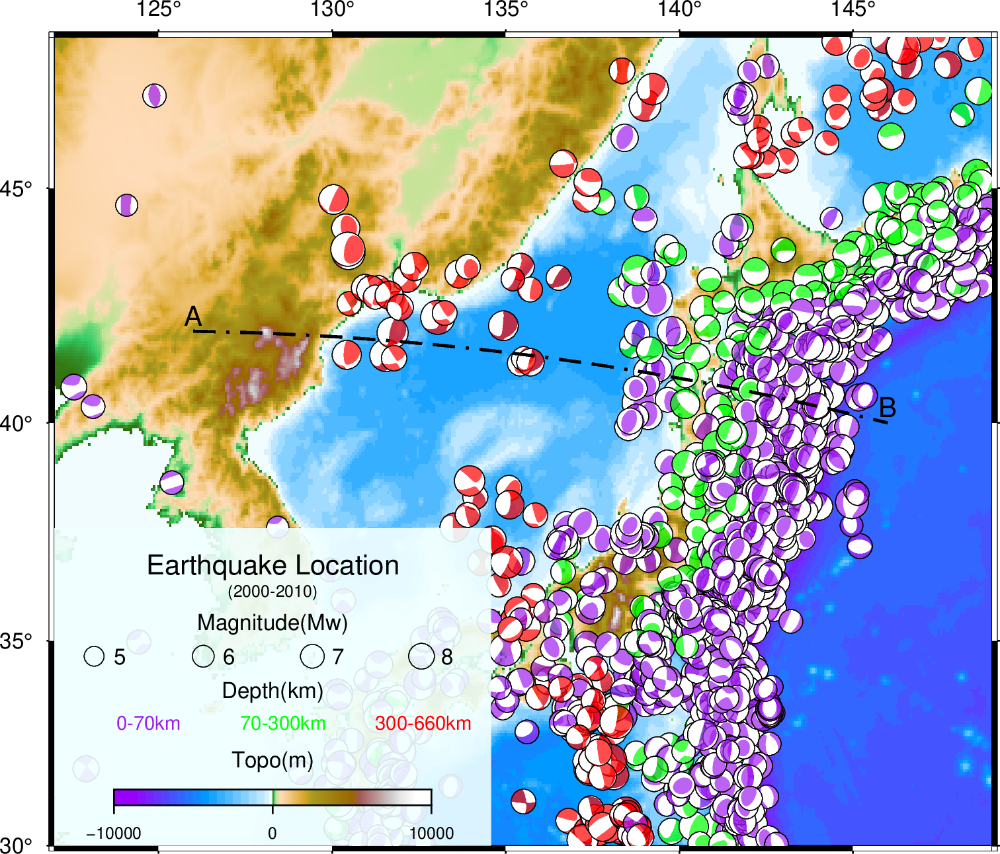
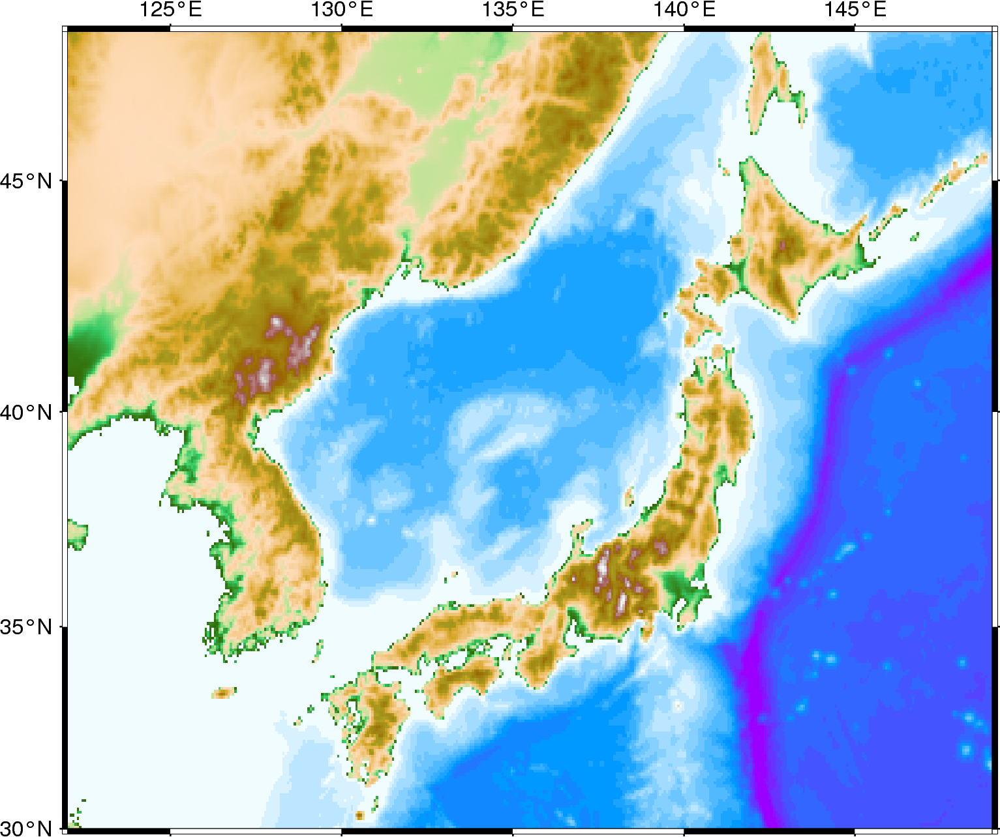

# README

```
.
├── plot.sh  # GMT6+bash
├── plot.py  # pygmt               
├── data                    
│   ├── eastchina.grd  # 生成的地形数据
│   └── FMC.txt        # 地震数据
├── cpt                    
│   ├── depth.cpt  # 生成的cpt文件
├── fig  # 用于存放生成的图片文件                    
```


> 此文绘制了西太平洋俯冲带日本本州至中国东北段震中分布图以及俯冲带剖面上的地震分布，地震数据来自GCMT。

参考链接: https://gmt-china.org/example/ex026/

------

## `plot.sh`(GMT6+bash)

成图效果：




## `plot.py`(pygmt)

使用[pygmt.Figure.**meca**](https://www.pygmt.org/latest/api/generated/pygmt.Figure.meca.html?highlight=meca)在绘制震源机制时遇到了一些问题，

暂时成图效果如下：




**不由得感叹，`GMT+bash`真香。或许`Python`数据处理输出，再使用`GMT+bash`绘图的工作流才是正解。**

因此`VScode`+`WSL`+`Python(in Windows)`的工作环境可能真的是王道了

我的[PygmtDemo](https://github.com/LevCarlo/PygmtDemo)似乎还没开始就已经结束了😂😂😂